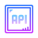
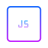

# Overview

Привет, мир. Меня зовут Вячеслав. Я начинающий фронтенд-разработчик. Я изучал HTML, CSS, JS, NodeJS, ReactJS, ExpressJS.

- :star: Хочу работать в опытной команде :grey_exclamation:
- :sparkles: Стремлюсь получить максимум знаний и навыков :exclamation:
- :fire: Стремлюсь работать производительно и писать "чистый" и читабельный код :globe_with_meridians:
- :collision: Хочу освоить новые фреймворки :mega:

# Мои проекты
- Проект "Mesto" - сайт для добавления интересных мест России.
- Проект "Movies" - сайт для добавления видео из стороннего api в свое избранное.

# :computer: Мой стек:
HTML, CSS, БЭМ, JS, NodeJS, ReactJS, ExpressJS, Git, ReactHooks

